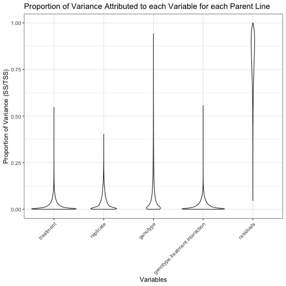
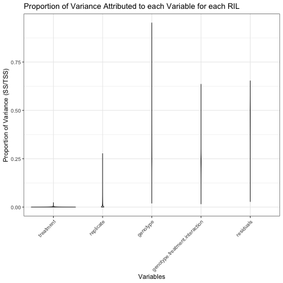
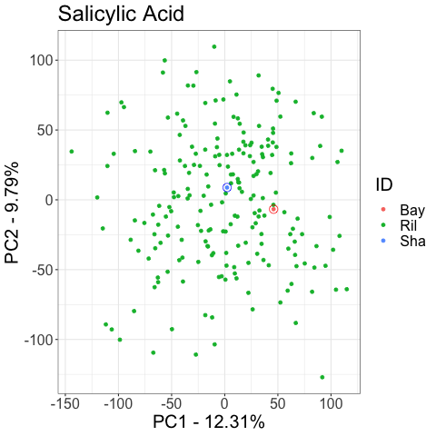
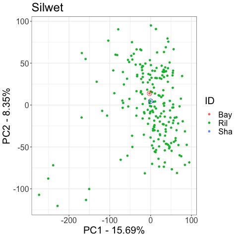
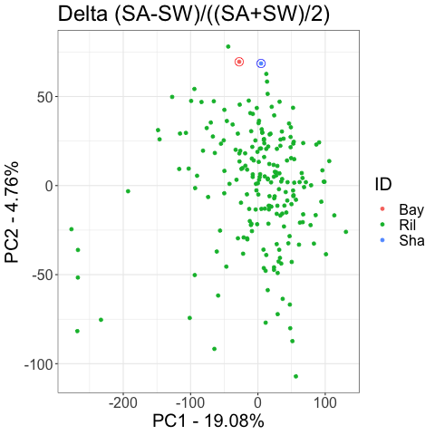
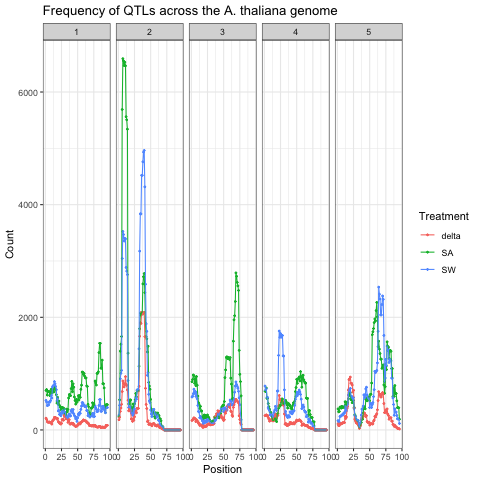

# CisTransPlasticity
Analyzing the Cis/Trans Regulation of Plasticity - eQTLs of Salicylic Acid Treatments

## Project Overview
Current analytical approaches studying the regulation of gene expression in response to environmental cues (hereby called plasticity) 
have a built in statistical bias for cis-regulatory elements (genomic features adjacent to gene of interest) and are underpowered to 
find trans-regulatory elements (genes and features unlinked to gene of interest but causal to the gene). Consequently, it is unclear if 
our current perception of genetic control of plasticity is accurate. Developing a more comprehensive and confident understanding of 
genetic control of plasticity will provide an alternative strategy to address how to control yield of important crops in fluctuating 
environments. To circumvent potential statistical bias, I am using transcriptomes from recombinant inbred lines of Arabidopsis 
thaliana, which have no population structure and are biallelic. This project uses quantitationve trait loplasticity and tests if the 
observed cis-regulatory bias is actually a statistical artifact.

### Data 
write about everything that was done to original data up to this point, cite kliebenstein and loudet papers
## Workflow
### Significance Tests
Script:[significance_comparison.R](Scripts/significance_comparison.R)

### Principal Component Analysis
Script: [PCA.R](Scripts/PCA.R)

### 3 Quantitative Trait Loci Anass/figures_cistrans.R)
### Effect Size Calculation
Scripts: [SAqtl.R](Scripts/SAqtl.R), [SWqtl.R)](Scripts/SWqtl.R), [SASWqtl.R](Scripts/SASWqtl.R)

### Randomization and Permutations
Script: [qtl_slidingwindow_and_permutations.R](Scripts/qtl_slidingwindow_and_permutations.R)
### Cis Vs Trans Identification and Quantification
Scripts:[cistrans_distance_calculator.R](Scripts/cistrance_distance_calculator.R), [figures_cistrans.R](Scripts/figures_cistrans.R)
### Effect Size Calculation
Scripts: [QTL_effectsize.R](Scripts/QTL_effectsize.R) 
